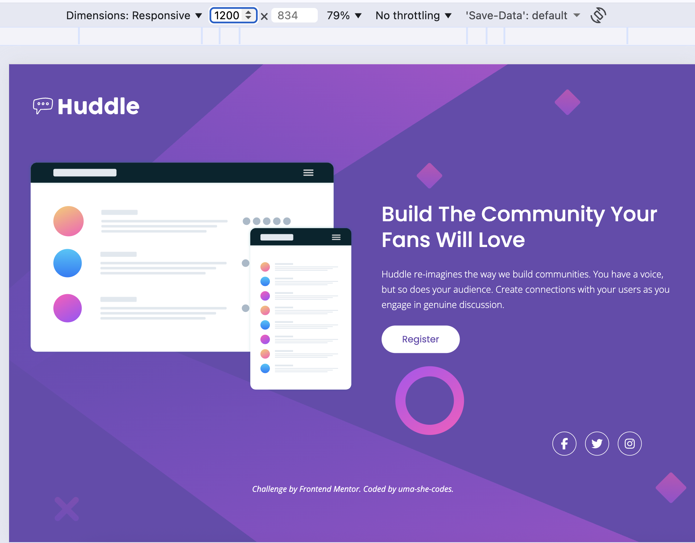
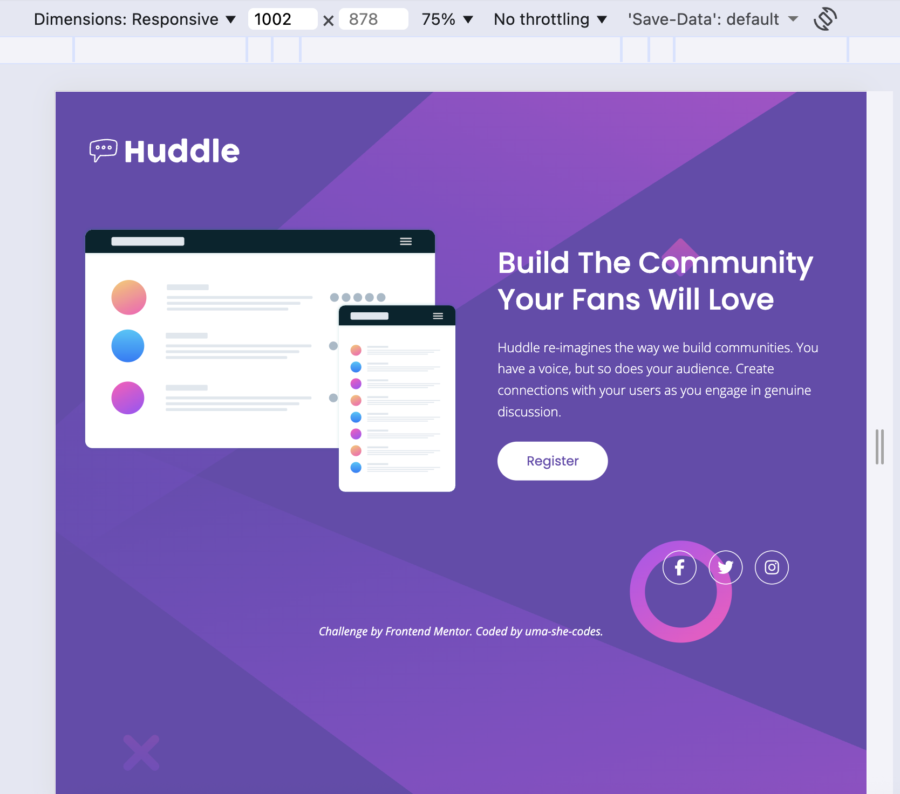
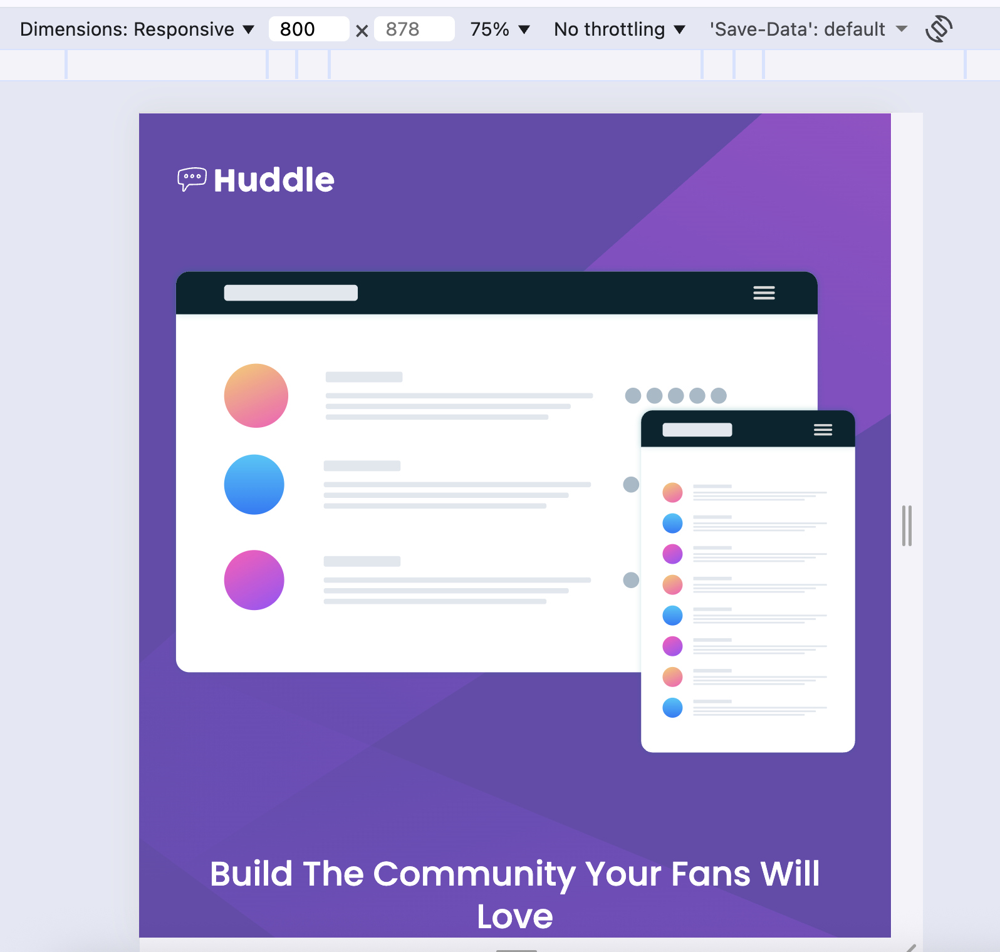
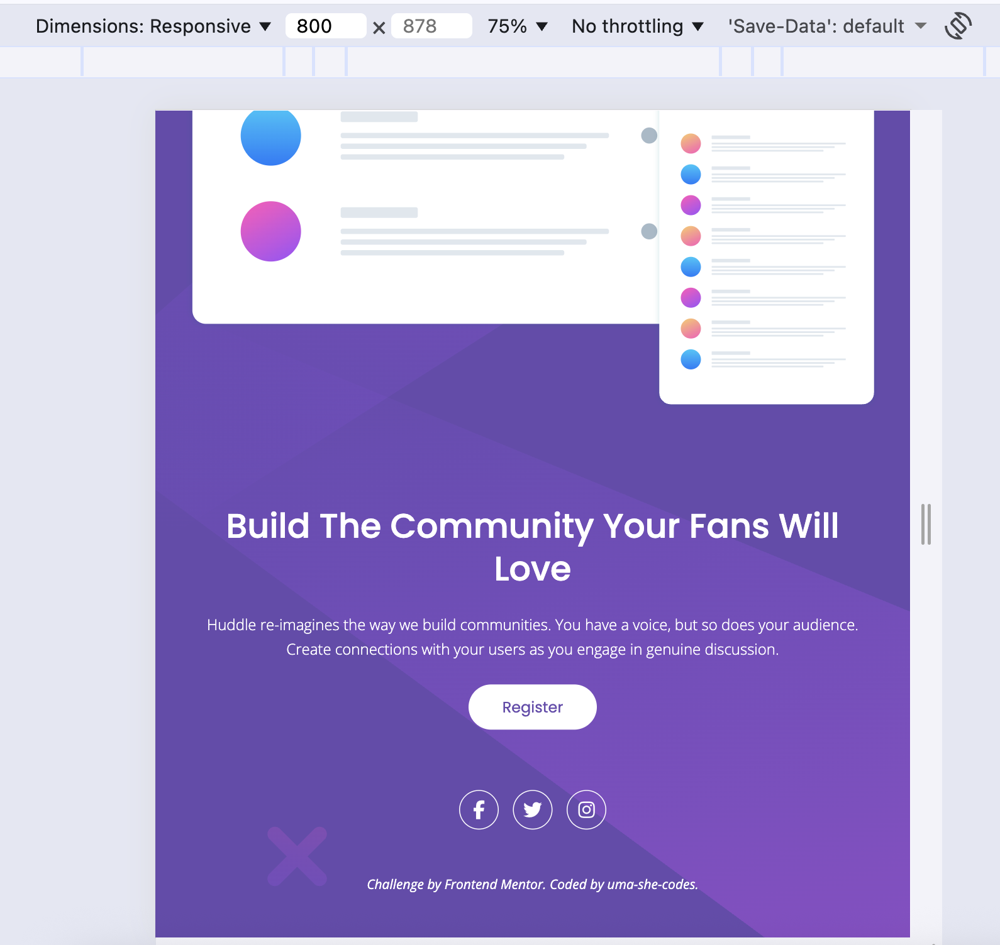
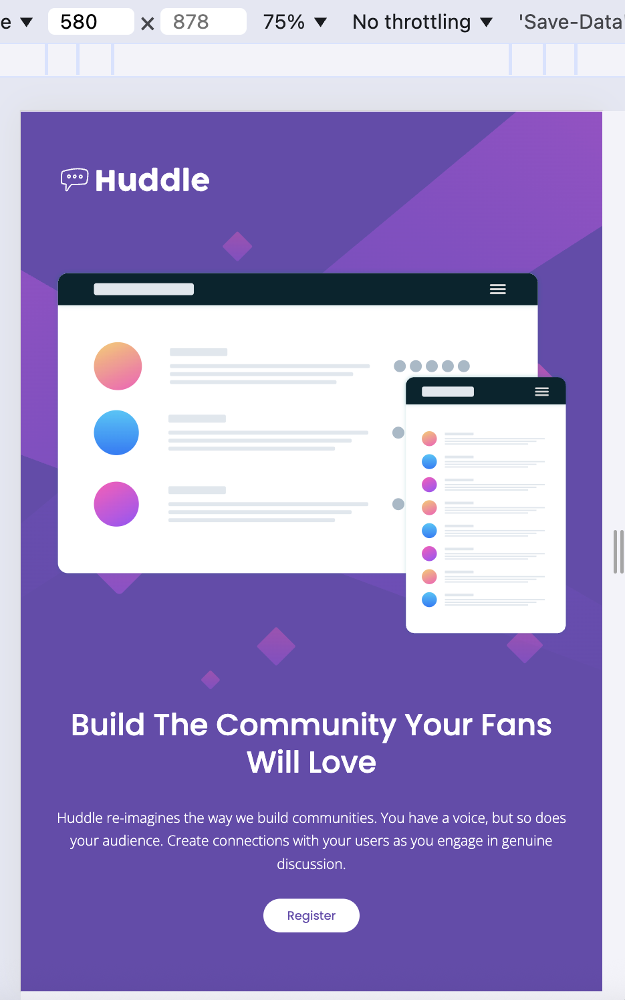

# Huddle Landing Page – Responsive Frontend Challenge

## Overview

This project is a solution to the Huddle landing page challenge from Frontend Mentor. The goal was to build a responsive page based on the provided design and ensure consistent layout behavior across different screen sizes.

## Links

- Live Site: https://huddle-frontend-mentor-challenge.vercel.app
- Repository: https://github.com/uma-codespace/huddle-landing-page
- Challenge: https://www.frontendmentor.io/challenges/huddle-landing-page-with-a-single-introductory-section-B_2Wvxgi0

## Screenshot

## Built With

- Semantic HTML5
- CSS3 (Flexbox & Grid)
- Responsive Design using media queries
- Desktop-first approach

## What I Learned

- Implementing a responsive two-column layout using Grid, with Flexbox for component-level alignment
- Applied breakpoint strategy based on content behavior rather than fixed device sizes
- Improved handling of spacing and typography scaling across viewports
- Strengthened understanding of how layout direction (row → column) impacts visual hierarchy

## Challenges

Maintaining visual balance between the illustration and text at intermediate screen sizes (~992px and ~580px) was challenging, as the layout began to feel constrained and less readable

## Solution

Introduced intermediate breakpoints to:

- Adjust spacing and typography progressively
- Transition from a two-column layout to a single-column layout at optimal points
- Preserve readability and visual hierarchy across devices

## Continued Development

- Refine spacing system for better scalability and consistency
- Explore deeper use of Flexbox for adaptive layout patterns
- Improve component reusability and structure

## Acknowledgments

Challenge provided by Frontend Mentor.
